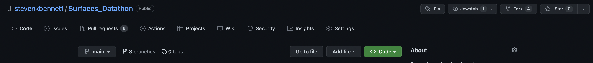

# Welcome to the IMSE Datathon!

## Data
--------

Data has been obtained from the Catalysis-Hub (https://catalysis-hub.org/).
The `data` directory contains the following files:
- `Test_Input.csv` - contains the input data for the test set including descriptors.
- `Train.csv` - contains the input (including descriptors) and output files for the training set.
- `coordinates`
  - Files of the name `{ID}_{ADSORBANT}_STAR.xyz` contain the XYZ coordinates of surface of the metal.
  - Files of the name `{ID}_{ADSORBANT}_COSTAR.xyz` contain the XYZ coordinates of surface of the metal with the adsorbent.
  - `Test_Energies_Enc.csv` - contains the energies of the test set.
  - `soap.csv` contains the SOAP descriptors for the training set for the second task.
  - `additional_descriptors` contains the additional descriptors you may find useful for the first task.

## Tasks
--------
### Task 1 - 60 points:

In task 1 your goal will be to predict the energy of the adsorbed molecule given the metal, surface plane, and absorbate using input data in `Train.csv`.
In this file you will find a list of pre-calculated descriptors for the metal, including the HOMO-LUMO gap of both the metal and adsorbates. The same set of pre-calculated descriptors are provided for the test set of molecules.

Some descriptors will be better predictors than others, so you may want to use feature selection to select the most important ones.
You may also calculate the additional features using Python packages such as [RDKit](https://www.rdkit.org) and [ASE](https://wiki.fysik.dtu.dk/ase/).

We also provide some additional descriptors in the `additional_descriptors` folder, however, these will require manual matching to the rows in the train and test sets using the `ID` column across the files.
You will also find the code used to generate the additional descriptors in the `make_2d_descriptors.py` file, which makes use of [MatMiner](https://hackingmaterials.lbl.gov/matminer/). You may find this useful in calculating your own descriptors!

### Task 2 - 30 points:

In task 2 your goal will be to predict the energy of the adsorbed molecule onto a surface using just atom coordinate information.
For this task, you will need to use the files in `coordinates` and use descriptors based on the atom geometries. An example code of how to do this is provided in the `make_3d_descriptors.py` file.

One common approach to doing this is to use SOAP kernels to encode the local atom environments around a molecule. We provide the pre-calculated SOAP matrices in `soap_descriptors.csv` in the `data` diretory, however, you may want to explore other methods, and machine learning models better suited to handling this type of input data, such as neural networks. In this file, the `ID` matches the `ID` in the main train and test files.

## Making Predictions
----------------------
We have a held-out test set of molecules that we will use to evaluate the predictions of each of your models on.
To perform an evaluation of your model we will use GitHub.
Firstly, press the `fork` button on the top-right of the page to create a personal copy of the repository. You can use this copy to collaborate with team mates and test your code.

Next on your copy of the repository, click the `Add file` button to add your predictions.

<strong>IMPORTANT: The files must be called `task_1_predictions.csv` and `task_2_predictions.csv` and contain 29 rows each. Each row corresponds to an energy of a molecule in the test set.</strong>

Finally, once your files have been added, go back to the main GitHub repository and press the `Pull Requests` tab. Press `New Pull Request` and then `compare across forks` at the top. You should see your files appear in the pull request.
Then select `Create Pull Request`.

After a short while, a comment should appear with your score. You only need to submit a single pull request. To update your predictions, simply add new files to the repository and the scoring will execute automatically.

### Task 3 - 10 points Presentations
------------------------------------

At the end of the two days, we will ask you to present your work in a short presentation. In this presentation, we are looking for creative ideas as to how your group tackled the problem!